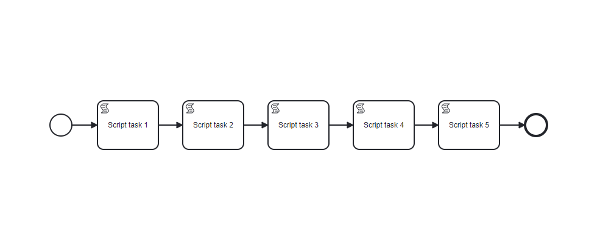
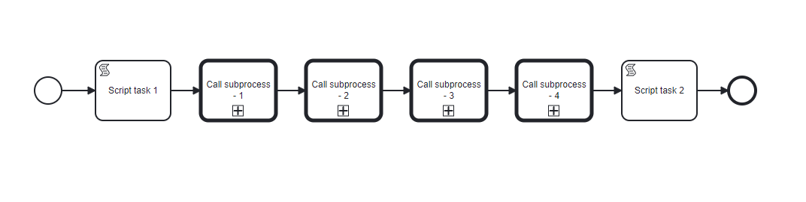
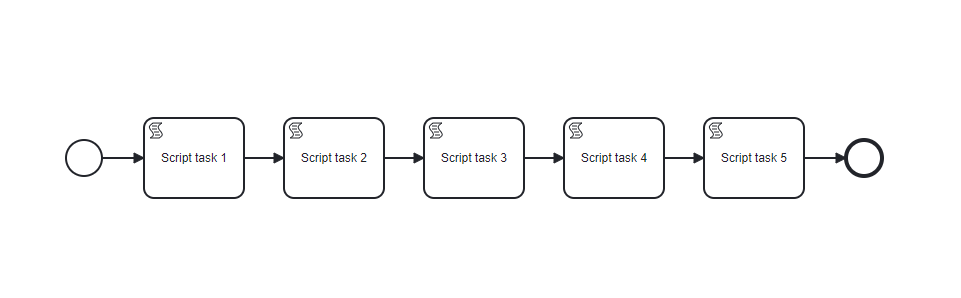

# Camunda API Benchmarks

## [Results of benchmarks](results%2FResults.md)

## [Scenarios](scenarios)

## Docker composes

1. Basic
   - Camunda: **Camunda bpm Platform - 7.14.0**
   - DB: **Postgres - 12.1**
   - File name: `camunda_7_14_postgres_3_17.yaml`
   - Command `docker compose -f ./docker/camunda_7_14_postgres_12_1.yaml up`
   - Task list URL: [http://localhost:8080/camunda/app/tasklist/default/#/login](http://localhost:8080/camunda/app/tasklist/default/#/login)
   - Username: **demo**
   - Password: **demo**

## Processes

| Name                   | ID                     | Diagram                                                                            |
|------------------------|------------------------|------------------------------------------------------------------------------------|
| Benchmarks process 1   | Benchmarks_Process_1   |      |
| Benchmarks process 2-1 | Benchmarks_Process_2_1 |  |
| Benchmarks process 2-2 | Benchmarks_Process_2_2 |  |